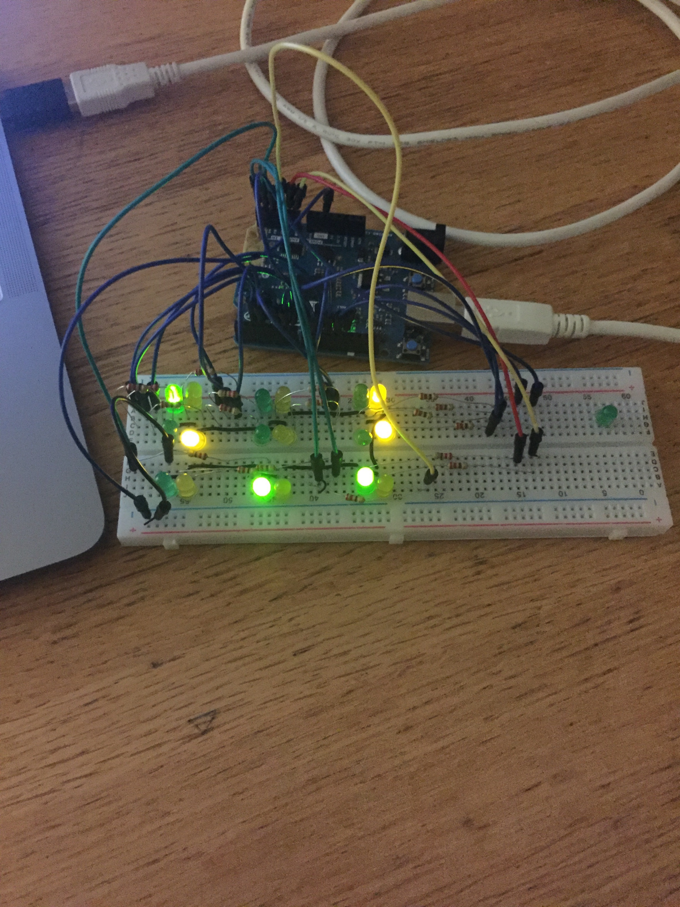
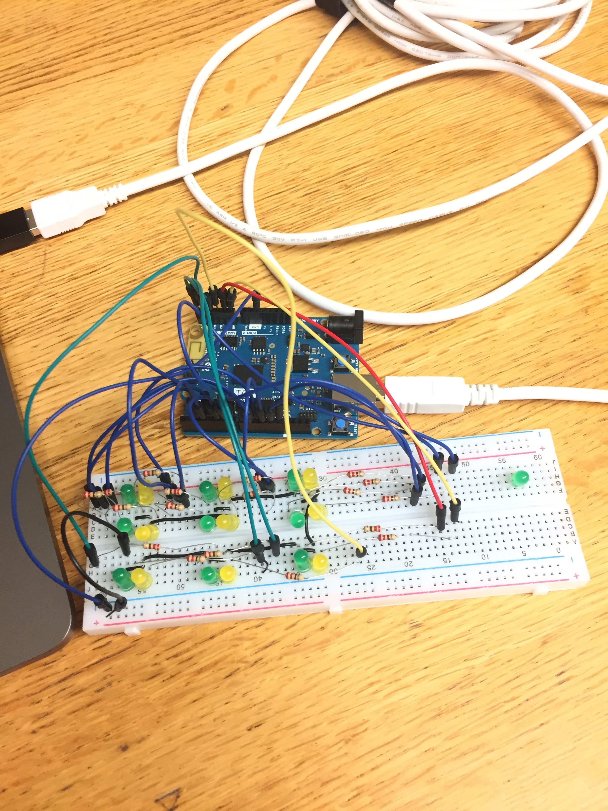
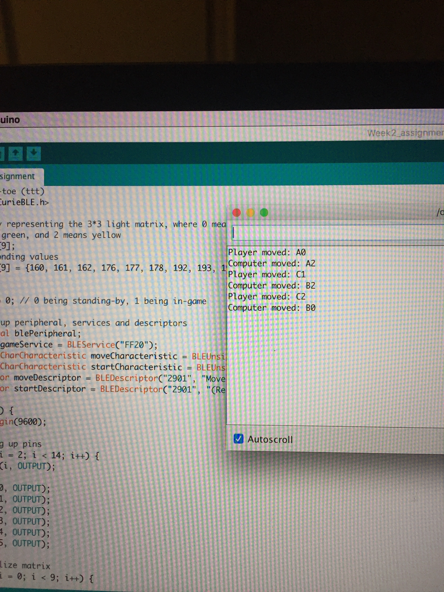
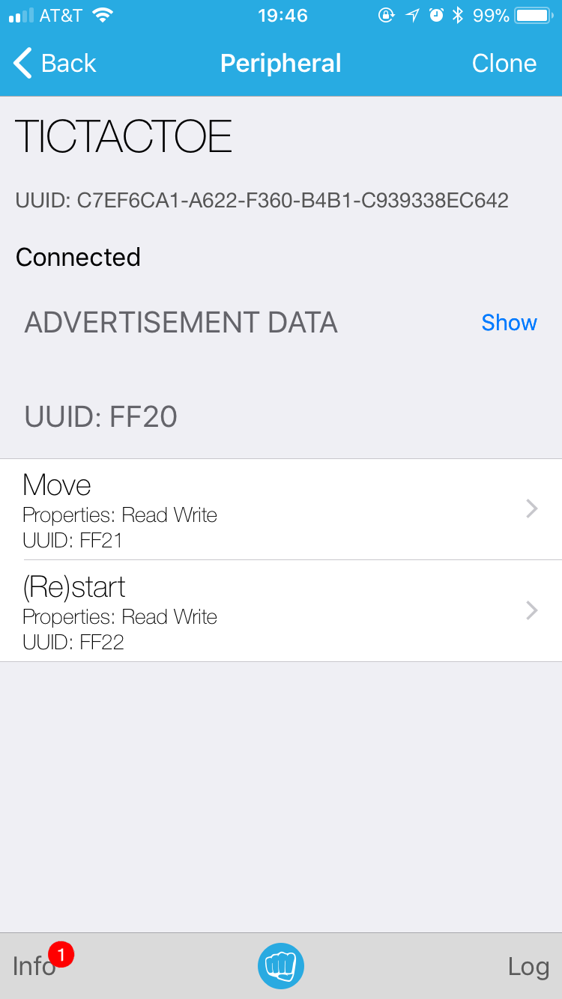
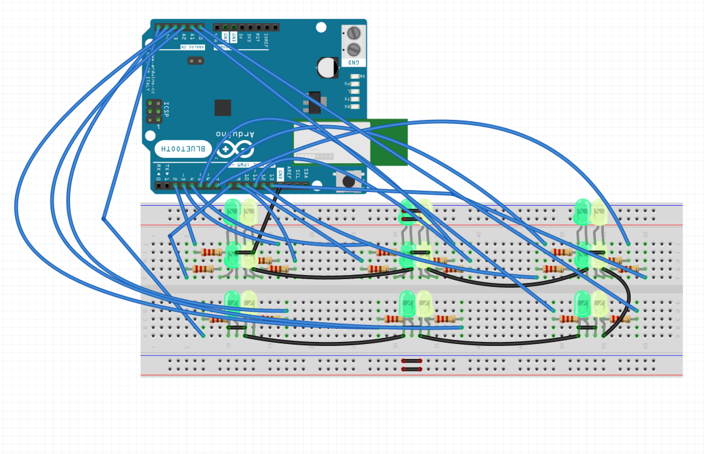
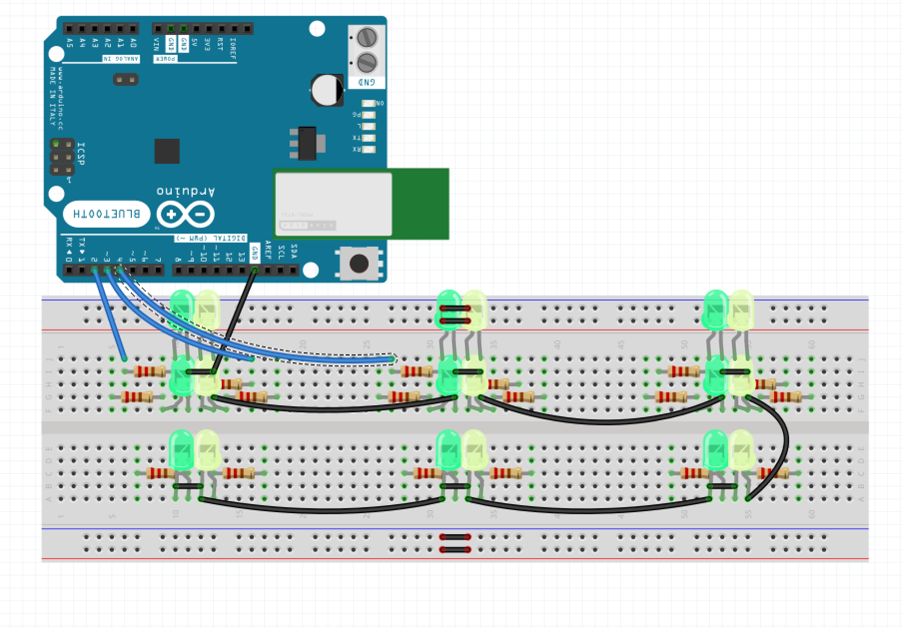

# Week2 Assignment - Bluetooth Controlled Tic-tac-toe

## Introduction
For this week's assignment, I come up with an idea of makeing a tic-tac-toe game on a breadboard that can be controled by a smart phone through bluetooth. The board for this tic-tac-toe board is 3 * 3 in dimension, and is built with 9 pairs of LEDs (pictures are shown below). In this project, there is one service, called "TICTACTOE" with, two characteristics, "Move" and "Start". To play the game, a player would first click the "Start" characteristic, and input a random value to start the game. After that, the player can put down his move by inputing a position(A0, B2, etc), then the computer(microprocessor) would respond, and so on and so forth. A player can restart the game by operate in the "Start" characteristic once again, either in the middle of a game, or when the game naturally ends.

## Service, characteristics and UUIDs
As mentioned above, the service, characteristics and UUIDs are as the following:
- Service: TICTACTOE; UUID: FF20
	- This is basically a game service, of tic-tac-toe, as described above
- Characteristic 1: MOVE; UUID: FF21
	- Type: Read | Write
	- Valid inputs: A0, A1, A2, B0, B1, B2, C0, C1, C2
	- Description: Using this, a user controls his/her moves by inputing a valid position mark
- Characteristic 2: (Re)Start; UUID: FF22
	- Type: READ | Write
	- Valid inputs: any
	- Description: A user can start or restart the game using this characteristic by inputting any character.

## Schematics
*Note: Since the schmatics for this project is very complex, here I attach two graphes,
one with the wires connecting with the arduino 101, one without, so it might be less messy. The basic idea is connect the ground of all the LEDs together, and connect each positive end of the LEDs to all the arduino pins*

## Some thoughts and possible improvement
For this project, the codes and the implementation of Bluetooth LE are quite straight forward to me. However, what bothers me the most is the routing of wires. The board for tic-tac-toe implementing by LEDs makes designing and building on breadboard very complicated and time consuming. The original plan was to use RGB leds, but those are out of storage at ITP. Also, maybe using something like a LED matrix could be better.

What's more, I thought about adding some notifications for my peripheral, such as sending the information of the status, like game results and winner to the phones. However, to make the notifications make more sense, the messages should be something like a string... but I wasn't able to figure out how to acheive that.
