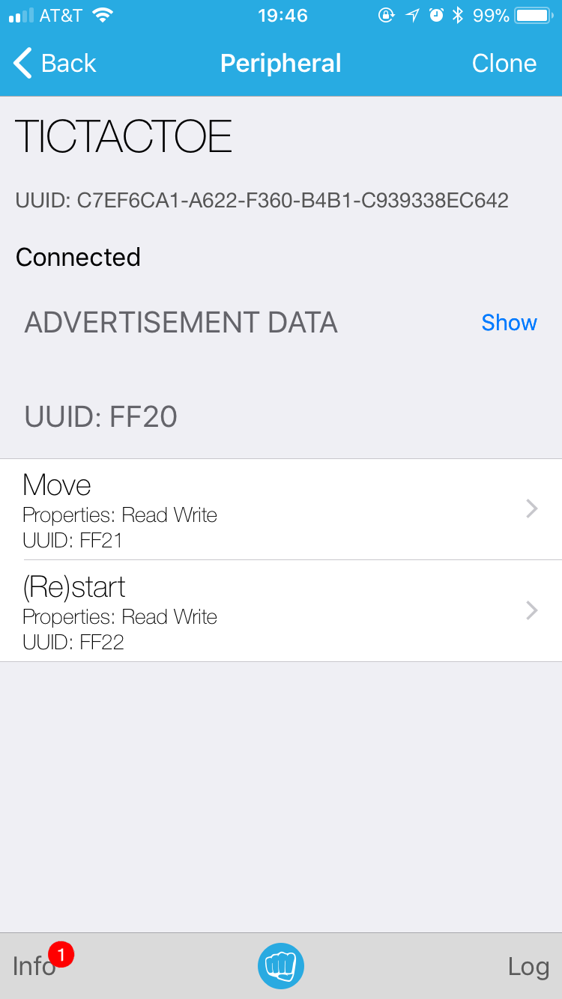

# Week2 Assignment - Bluetooth controlled tic-tac-toe

## Introduction
For this week's assignment, I come up with an idea of makeing a tic-tac-toe game on a breadboard that can be controled by a smart phone through bluetooth. The board for this tic-tac-toe board is 3 * 3 in dimension, and is built with 9 pairs of LEDs (pictures are shown below). In this project, there is one service, called "TICTACTOE" with, two characteristics, "Move" and "Start". To play the game, a player would first click the "Start" characteristic, and input a random value to start the game. After that, the player can put down his move by inputing a position(A0, B2, etc), then the computer(microprocessor) would respond, and so on and so forth. A player can restart the game by operate in the "Start" characteristic once again, either in the middle of a game, or when the game naturally ends.

## Service, characteristics and UUIDs
As mentioned above, the service, characteristics and UUIDs are as the following:
- Service: TICTACTOE; UUID: FF20
- Characteristic 1: MOVE; UUID: FF21
	- Type: Read | Write
	- Valid inputs: A0, A1, A2, B0, B1, B2, C0, C1, C2
	- Description: Using this, a user controls his/her moves by inputing a valid position mark
- Characteristic 2: (Re)Start; UUID: FF22
	- Type: READ | Write
	- Valid inputs: any
	- Description: A user can start or restart the game using this characteristic by inputting any character.

##
