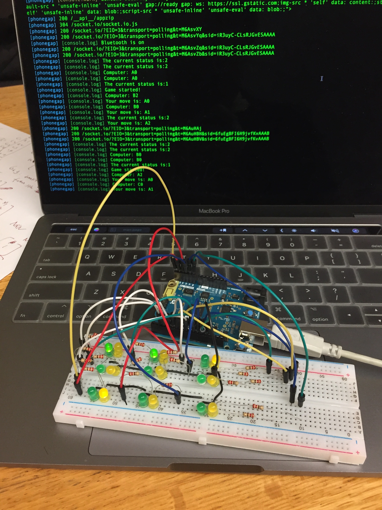
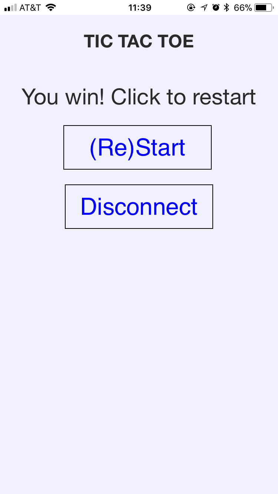
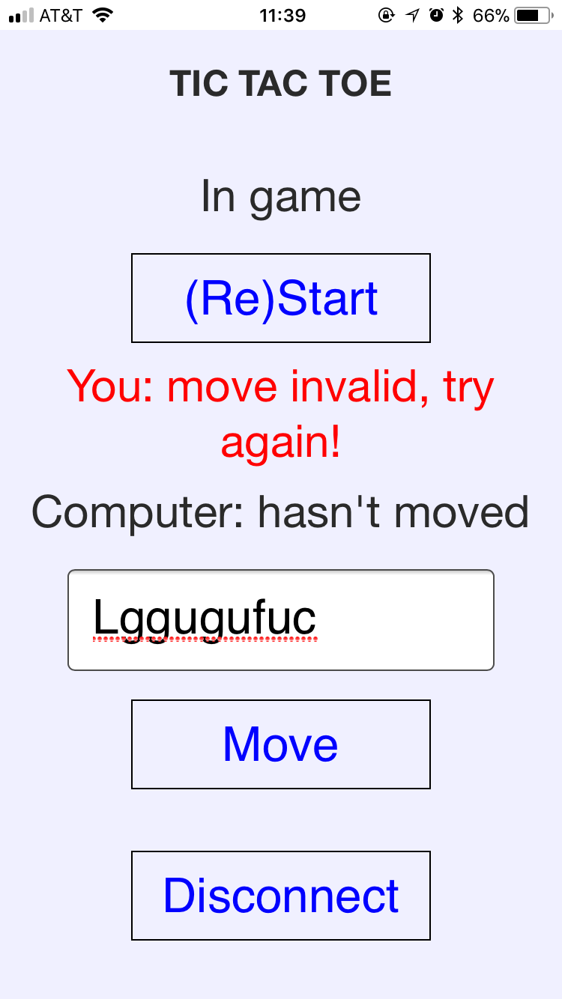
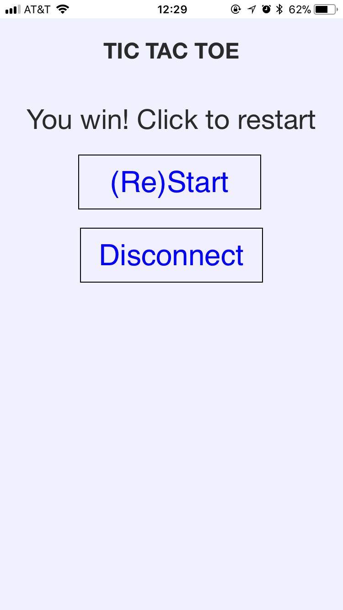

# Week3 Assignment - Bluetooth Controlled Tic-tac-toe (v2.0 phonegap)

## Introduction
For this week's assignment, I continued with an idea of making the tic-tac-toe game controlled by a smart phone through bluetooth. This time, I designed a phonegap app to control the game, instead of controlling it using lightBlue. Meanwhile, I added two characteristics for the bluetooth peripheral, which are both of type notification, one is responsible for telling the status of the game, and the other one tells the most recent moves of both the user and the computer. In summary, in this project, there is one service, called "TICTACTOE" with, four characteristics, "Move", "Start", "Staus" and "computerMove".

*Note: meaning that there are new code created for both central device and the peripheral (arduino), and both are added to this repository!*

The way to play the game is basically the same as playing it with the lightBlue application. The only difference is that this time there is no need to switch between the pages for different characteristics, since they are all combined in one page. Besides, the user experience should be way better since there are notifications telling the player how the game is going, and provides instructions and alerts when the player is not sure what to do.

*Note: for more detailed descriptiong, please watch the demo video*

## Service, characteristics and UUIDs
As mentioned above, the service, characteristics and UUIDs are as the following:
- Service: TICTACTOE; UUID: FF20
	- This is basically a game service, of tic-tac-toe, as described above
- Characteristic 1: MOVE; UUID: FF21
	- Type: Read | Write
	- Valid inputs: A0, A1, A2, B0, B1, B2, C0, C1, C2
	- Description: Using this, a user controls his/her moves by inputing a valid position mark
- Characteristic 2: (Re)Start; UUID: FF22
	- Type: READ | Write
	- Valid inputs: any
	- Description: A user can start or restart the game using this characteristic by inputting any character.
- Characteristic 3: Status; UUID: FF23
	- Type: READ | Notify
	- Description: Tells a user what the current status of the game is, namely, "waiting to start", "in-game", "game-ends (win, lose, draw)".
    - Specs:
        - 0: Waiting for player to start;
        - 1: In game;
        - 2: Player wins;
        - 3: Computer wins;
        - 4: Draw;
- Characteristic 4: ComputerMove; UUID: FF24
	- Type: READ | Notify
	- Description: Tells a user what the previous move of the computer was. *Note: the app also shows what the previous move of the player is, but that is handled by central completely.*

## Pictures and screenshots

## Some thoughts
Taking your advice from the feedback of the last assignment, I add the notifications that can facilitate the game and improve user experience. Just want to say here that I combine the two of the notifications that you mentioned together, namely status and game result (i.e. "Wait for starting", "in-game", "player wins", "computer wins", "draw"), since it seems to make more sense.

Meanwhile, there is one small problem that I encountered. Since in the design of my game, I added the end-game/start-game display just to be fancy(light all the LEDs one-by-one), there are delays in my code (either the hard delay function or the one implemented by using millis function). This causes tiny delays in the interaction between the central and peripheral (just when the game starts and ends in my case). So, is there a way to solve this? Also, does this mean that bluetooth systems that involves multiple processes and tasks would run better on a device that supports multi-thread and multi-process better?
