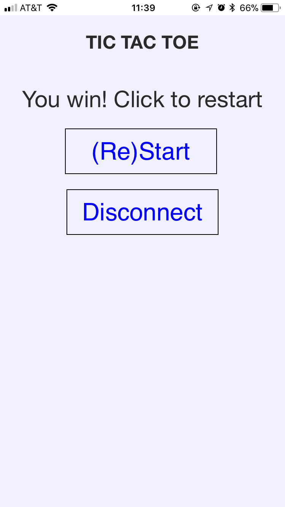
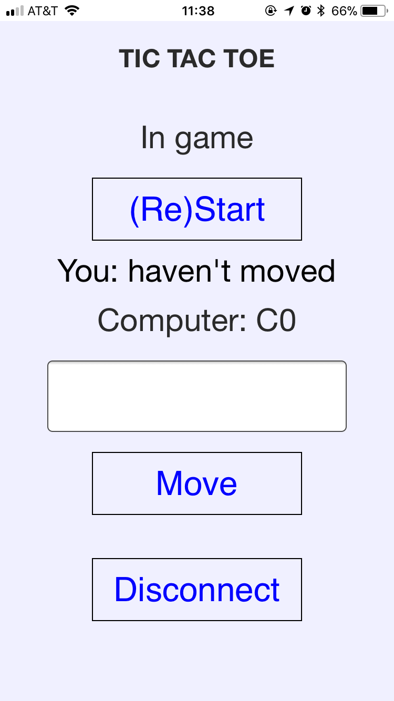

# Week3 Assignment - Bluetooth Controlled Tic-tac-toe (v2.0 phonegap)

## Introduction
For this week's assignment, I continued with an idea of makeing the tic-tac-toe game controled by a smart phone through bluetooth. This time, I designed a phonegap app to control the game, instead of controlling it using lightBlue. Meanwhile, I added two characteristics for the bluetooth peripheral, which are both of type notification, one is responsible to tell the status of the game, and the other one tells the most recent moves of both the user and the computer. In summary, in this project, there is one service, called "TICTACTOE" with, four characteristics, "Move", "Start", "Staus" and "computerMove".
The way to play the game is basically the same as playing it with the lightBlue application. The only difference is that this time there is no need to switch between the pages for different characteristics, since they are all combined in one page. Besides, the user experience should be better since there are notifications telling the player how the game is going, and provides instructions and alerts when the player is not sure what to do.

## Service, characteristics and UUIDs
As mentioned above, the service, characteristics and UUIDs are as the following:
- Service: TICTACTOE; UUID: FF20
	- This is basically a game service, of tic-tac-toe, as described above
- Characteristic 1: MOVE; UUID: FF21
	- Type: Read | Write
	- Valid inputs: A0, A1, A2, B0, B1, B2, C0, C1, C2
	- Description: Using this, a user controls his/her moves by inputing a valid position mark
- Characteristic 2: (Re)Start; UUID: FF22
	- Type: READ | Write
	- Valid inputs: any
	- Description: A user can start or restart the game using this characteristic by inputting any character.

## Schematics
*Note: Since the schmatics for this project is very complex, here I attach two graphes,
one with the wires connecting with the arduino 101, one without, so it might be less messy. The basic idea is connect the ground of all the LEDs together, and connect each positive end of the LEDs to all the arduino pins*

## Some thoughts and possible improvement
For this project, the codes and the implementation of Bluetooth LE are quite straight forward to me. However, what bothers me the most is the routing of wires. The board for tic-tac-toe implementing by LEDs makes designing and building on breadboard very complicated and time consuming. The original plan was to use RGB leds, but those are out of storage at ITP. Also, maybe using something like a LED matrix could be better.

What's more, I thought about adding some notifications for my peripheral, such as sending the information of the status, like game results and winner to the phones. However, to make the notifications make more sense, the messages should be something like a string... but I wasn't able to figure out how to acheive that.
