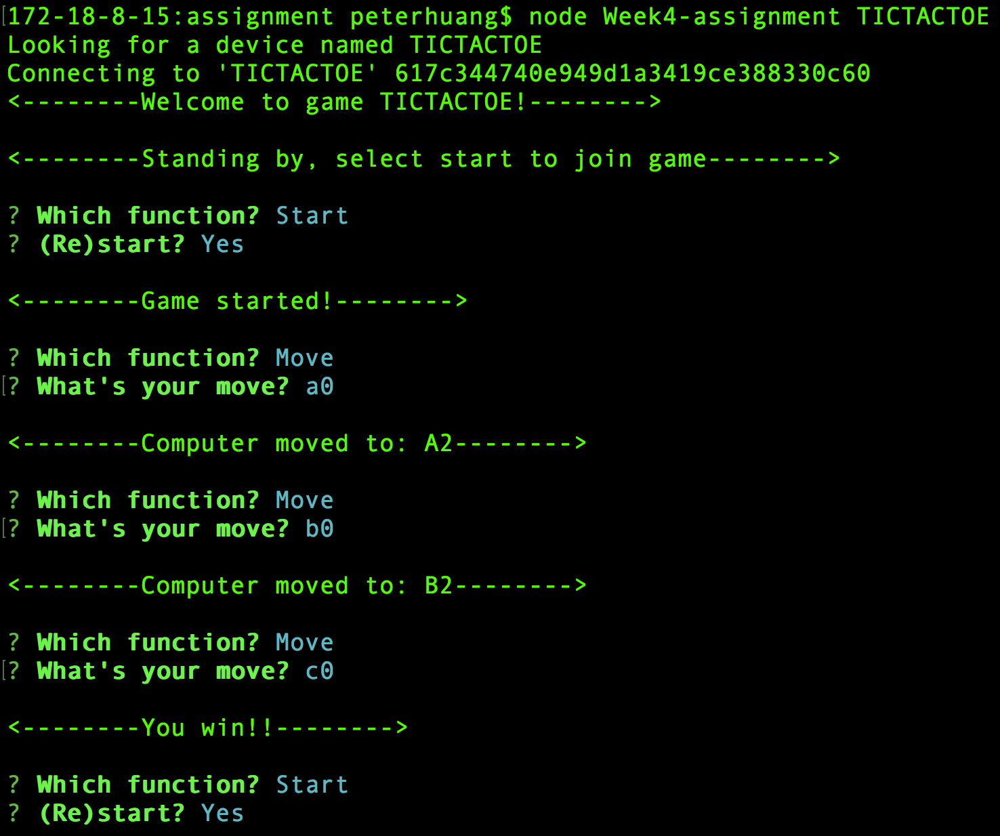
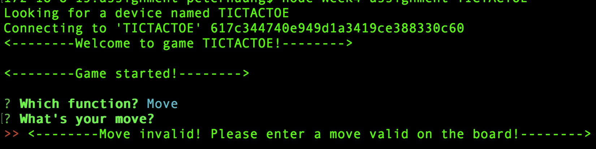

# Week4 Assignment - Bluetooth Controlled Tic-tac-toe (v3.0 Noble)

## Introduction
For this week's assignment, I designed a user interface running in terminal to control the TIC-TAC-TOC peripheral I built from the previous weeks. The libraries used are Noble and inquirer. Noble is used for handling bluetooth communication in node.js, and inquirer is used for creating a question based user interface.

*Note: Again, there are new code created for both central device and the peripheral (arduino), and both are added to this repository*

The way to play the game basically stays the same. The only differences are, first, the result of a game (the selections of lights) would stay put until the user press restart. Second, the interface is question based, therefore user interacts with a relatively more dynamic interface with questions prompted out at each step.

*Note: for more detailed descriptiong, please watch the demo video*

## Service, characteristics and UUIDs
As mentioned above, the service, characteristics and UUIDs are as the following:
- Service: TICTACTOE; UUID: FF20
	- This is basically a game service, of tic-tac-toe, as described above
- Characteristic 1: MOVE; UUID: FF21
	- Type: Read | Write
	- Valid inputs: A0, A1, A2, B0, B1, B2, C0, C1, C2
	- Description: Using this, a user controls his/her moves by inputing a valid position mark
- Characteristic 2: (Re)Start; UUID: FF22
	- Type: READ | Write
	- Valid inputs: any
	- Description: A user can start or restart the game using this characteristic by inputting any character.
- Characteristic 3: Status; UUID: FF23
	- Type: READ | Notify
	- Description: Tells a user what the current status of the game is, namely, "waiting to start", "in-game", "game-ends (win, lose, draw)".
    - Specs:
        - 0: Waiting for player to start;
        - 1: In game;
        - 2: Player wins;
        - 3: Computer wins;
        - 4: Draw;
- Characteristic 4: ComputerMove; UUID: FF24
	- Type: READ | Notify
	- Description: Tells a user what the previous move of the computer was.

*Note: the app provides validation for each input of the moves. If a move is not valid on the given board or a move is conflicted with a previous move, then the user would be alerted and required to choose an alternative move.*

## Pictures and screenshots
*regular interactions*

*alert on invalid moves*

## Some thoughts
Most of the difficulties I encountered in this project is about using inquirer. Using inquirer itself is fine, but using it with regular outputs (console.log) and notifications could be tricky.

The first problem I encountered was on dealing with the interference between regular logs and the questions generated by inquirer. It seems like logging out a message immediately after a inquirer message would make inquirer refresh itself and push the question out again under the newly logged message, causing potential confusion for a user. To resolve this, I put all the calling to the function "ask()" after a logged message, so that no regular log would be generated immediately after a inquirer question.

The second problem I encountered was on dealing with the "race conditions" between inquirer questions themselves. This problem happens specifically when the computer wins the game (which is rare due to my dummy implementation of the computer-move function at the peripheral). The design of the game is that when the game ends, a notification of game status would be sent to the central, triggering the program to log out "you win"/"computer wins", and call "ask()" to ask whether the player wants to quit or restart. However, this might be a design flaw, the program of computer's move at the central would also call "ask()" for a player's move each time after a computer's move. Therefore, when computer wins, two calls of "asks()" would be executed, one asking for the player's next move, and the other asking for the decision of quit or restart, thus causing conflict. My first solution was to add a condition before computerMove's call on "ask()", so that it would not ask for player's next move when the computer already wins. However, although this prevents the program from crashing, it suffers from some kind of race condition. The condition is based on the notification of the game status, but which usually comes later than the call on the function "ask()". To remedy this, I add a timeout before the call of "ask" in the computer move function.

To summery, all the problems caused by "inquirer" seems to work out. However, the way I scatter those ask() functions everywhere bothers me. So maybe it would be better if there was a standard for designing the program implementing such question-based user interface.
