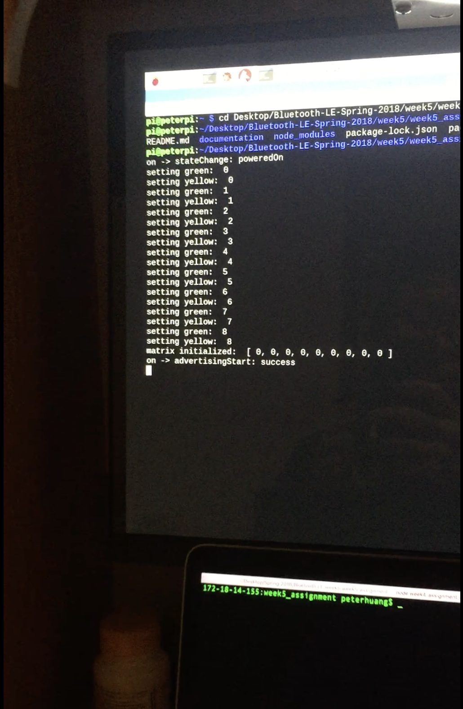

# Week5 Assignment - Bluetooth Controlled Tic-tac-toe (v4.0 Reimplement on Raspberry Pi)

## Introduction
For this week's assignment, I basically reimplemented the previous Arduino based Tic-tac-toe peripheral on Raspberry Pi. The programming used is javascript on node.js, with the dependencies being bleno and GPIO. The reimplementation is mostly done on the code for the peripheral, instead of the central application. Therefore, the application is still the one from last week, v3.0, with minor modifications, and the user interaction and terminal user interface stays basically the same.

Some modifications that I would like to point out are:
- Added a new status 5: restart, so that a message of restarting would be send it and will be explicitly displayed on the central application
- Adapted the wiring of the peripheral to the pins of GPIOs
	- *green LEDs: [5, 27, 26, 10, 1, 13, 24, 18, 21]*
	- *yellow LEDs: [22, 17, 19, 16, 25, 6, 23, 12, 20]*
- Modified the scan process of the application, so that a user can have two options:
	- Enter one or more device name, the application will choose the first hit among them
	- Omit the device name, so that the application will choose the first fit of service uuid
	- Reason: the way mac recognize raspberry Pi is strange. In my case, first it takes it as undefined, then after I pair it arbitrarily with the "undefined" raspberry Pi, my mac would then either recognize it as the local name, TICTACTOE, or the device name peterpi

*Also note that the code of the central application is also included in this folder, since there are some minor notifications*

## Service, characteristics and UUIDs
As mentioned above, the service, characteristics and UUIDs are as the following:
- Service: TICTACTOE; UUID: FF20
	- This is basically a game service, of tic-tac-toe, as described above
- Characteristic 1: MOVE; UUID: FF21
	- Type: Read | Write
	- Valid inputs: A0, A1, A2, B0, B1, B2, C0, C1, C2
	- Description: Using this, a user controls his/her moves by inputing a valid position mark
- Characteristic 2: (Re)Start; UUID: FF22
	- Type: READ | Write
	- Valid inputs: any
	- Description: A user can start or restart the game using this characteristic by inputting any character.
- Characteristic 3: Status; UUID: FF23
	- Type: READ | Notify
	- Description: Tells a user what the current status of the game is, namely, "waiting to start", "in-game", "game-ends (win, lose, draw)".
    - Specs:
        - 0: Waiting for player to start;
        - 1: In game;
        - 2: Player wins;
        - 3: Computer wins;
        - 4: Draw;
		- 5: Restart
- Characteristic 4: ComputerMove; UUID: FF24
	- Type: READ | Notify
	- Description: Tells a user what the previous move of the computer was.

*Note: the app provides validation for each input of the moves. If a move is not valid on the given board or a move is conflicted with a previous move, then the user would be alerted and required to choose an alternative move.*

## Pictures and screenshots
*regular interactions*

*alert on invalid moves*

*Raspberry Pi terminal*

*Restarting*

## Challenges, solutions and thoughts
1. *Node as a non-blocking library* Using javascript to write a mostly sequential piece of code could be troubling. I spent a long time implementing the part of light display that happens at each start/restart of the game. At first, I tried to use callbacks to ensure sequential execution, but it was too complicated for me to implement. Then, I tried to see whether the "writesyn" have created a way to work around this already, but it turns out it is not enough when you have multiple loops together for led control and want them to excecute one after another. Finally, I found out that using "setInterval" is a good way to do this, which provides both a timeout and synchronization.
2. *Bleno and noble* This is actually a two part problem:
	- Noble doesn't seem to recognize a raspberry pi running Bleno very well. As I mentioned above, sometimes it would recognize it as "undefined", sometimes as the local name "TICTACTOC", and sometime as the device name "peterpi".
	- I might be missing something, but when I am using noble application to control Bleno, the peripheral would remain is the state of "having been paired" even after the central has disconnected, thus denying any other further connection.
3. *Raspberry pi pins* The instruction that came with my raspberry Pi claims that all pins are available for GPIO except for the power and ground pins. This claim seems to be under certain constrains. Apparently, when using Bluetooth, the tx and rx pins are used for connection and would not work as GPIO pins. Meanwhile, it seems that the pins for SDA1 and SCL1 won't work as well (but oddly, the pins SDA0 and SCL0 works).
