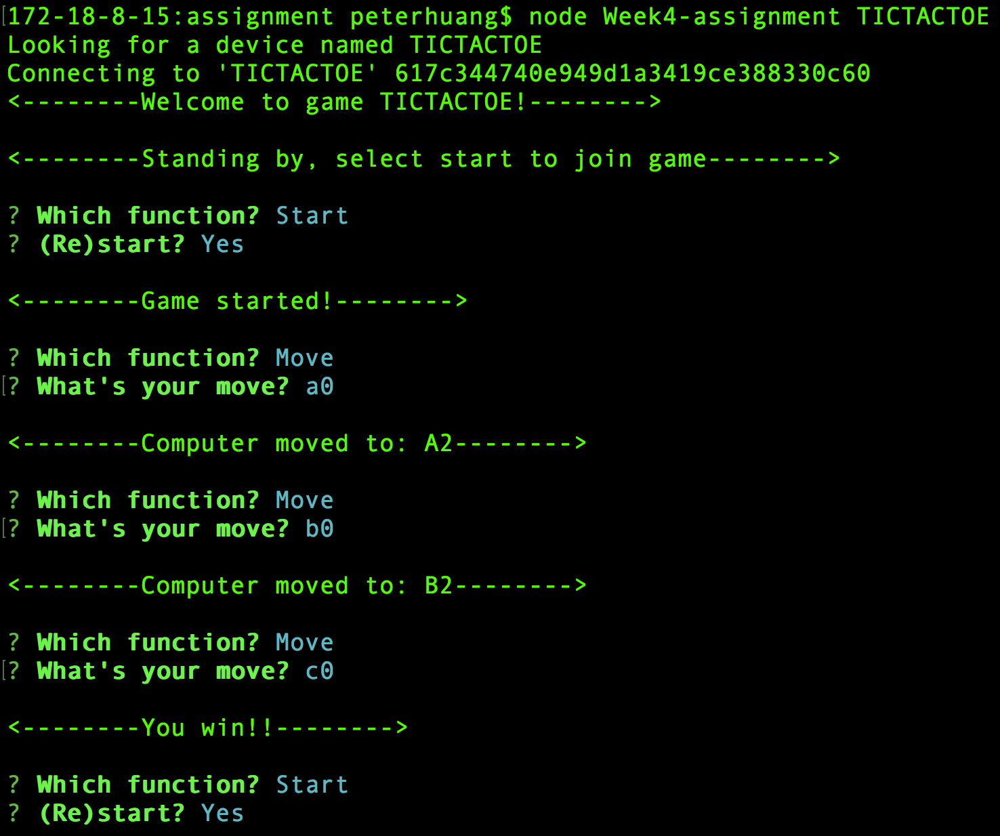
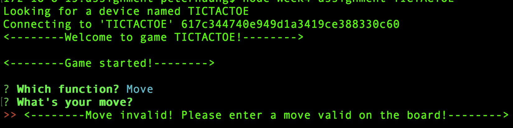

# Week5 Assignment - Bluetooth Controlled Tic-tac-toe (v4.0 Reimplement on Raspberry Pi)

*Note: some testing pending, to be updated soon!*

## Introduction
For this week's assignment, I basically reimplemented the previous Arduino based Tic-tac-toe peripheral on Raspberry Pi. The programming used is javascript on node.js, with the dependencies being bleno and GPIO. The reimplementation is mostly done on the code for the peripheral, instead of the central application. Therefore, the application is still the one from last week, v3.0, and the user interaction and terminal user interface stays basically the same. Meanwhile, note that I modified the wiring of the peripheral (for connecting to GPIO pins on raspberry pi), the specific pins are as the following:

*green LEDs: [5, 27, 26, 3, 1, 13, 24, 18, 21]*

*yellow LEDs: [22, 17, 19, 16, 25, 6, 23, 14, 20]*
*Also note that the code of the central application is also included in this folder*

*Note: for more detailed playing instructions, please watch the demo video*

## Service, characteristics and UUIDs
As mentioned above, the service, characteristics and UUIDs are as the following:
- Service: TICTACTOE; UUID: FF20
	- This is basically a game service, of tic-tac-toe, as described above
- Characteristic 1: MOVE; UUID: FF21
	- Type: Read | Write
	- Valid inputs: A0, A1, A2, B0, B1, B2, C0, C1, C2
	- Description: Using this, a user controls his/her moves by inputing a valid position mark
- Characteristic 2: (Re)Start; UUID: FF22
	- Type: READ | Write
	- Valid inputs: any
	- Description: A user can start or restart the game using this characteristic by inputting any character.
- Characteristic 3: Status; UUID: FF23
	- Type: READ | Notify
	- Description: Tells a user what the current status of the game is, namely, "waiting to start", "in-game", "game-ends (win, lose, draw)".
    - Specs:
        - 0: Waiting for player to start;
        - 1: In game;
        - 2: Player wins;
        - 3: Computer wins;
        - 4: Draw;
- Characteristic 4: ComputerMove; UUID: FF24
	- Type: READ | Notify
	- Description: Tells a user what the previous move of the computer was.

*Note: the app provides validation for each input of the moves. If a move is not valid on the given board or a move is conflicted with a previous move, then the user would be alerted and required to choose an alternative move.*

## Pictures and screenshots
*regular interactions*

*alert on invalid moves*

## Challenges, solutions and thoughts
	*TO BE UPDATED*
