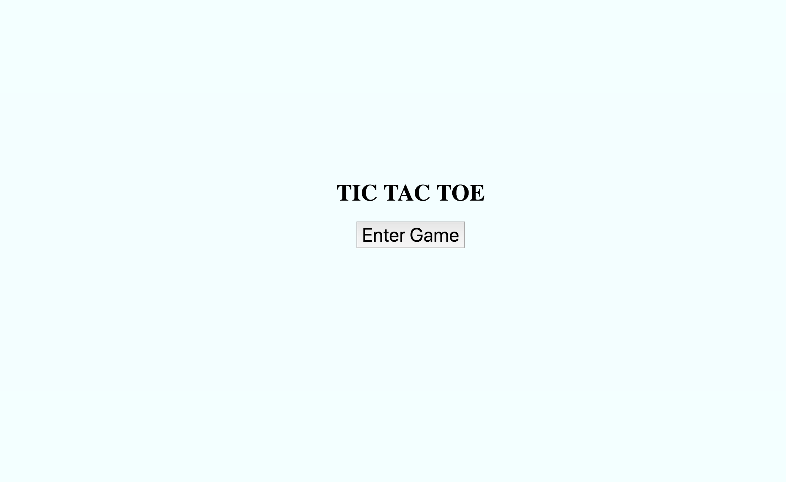
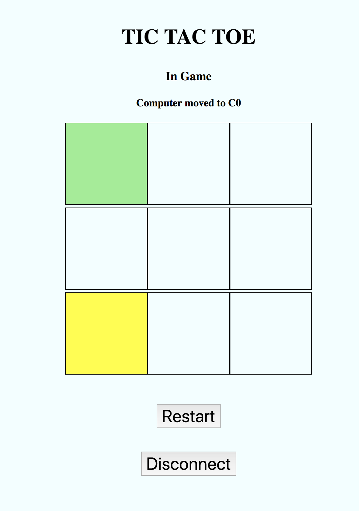

# Week6 Assignment - Bluetooth Controlled Tic-tac-toe (v5.0 Reimplement central with electron and web-bluetooth)

## Introduction
For this week's assignment, I basically reimplemented the central with electron and web-bluetooth. The web-bluetooth implementation uses a chrome web-bluetooth framework and the electron implementation uses noble.js and the framework provided by electron. The peripheral, is the same as that from the last week, namely the implementation on raspberry pi. The code for the peripheral is identical to the one from the last week, thereby included in this directory as well.

Some modifications that I would like to point out are:

*Please refer to the changes on the raspberry pi to the last week's documentation*
- Automatic start up
	- Last week I mentioned that the peripheral refuses to connect to another central device after the first disconnects from it. However, this problem somehow disappeared, but leading to a new problem, that is how should the new user adapt the previous status of the peripheral. One way would have been read them all and reconstruct the status at central, but I think this is not necessary, since the new player usually wants a new game. Therefore, I implemented in the code such that a "start" command would be sent automatically once the app starts, and in this way the user can play a new fresh game directly

## Service, characteristics and UUIDs
As mentioned above, the service, characteristics and UUIDs are as the following:
- Service: TICTACTOE; UUID: FF20
	- This is basically a game service, of tic-tac-toe, as described above
- Characteristic 1: MOVE; UUID: FF21
	- Type: Write
	- Valid inputs: A0, A1, A2, B0, B1, B2, C0, C1, C2
	- Description: Using this, a user controls his/her moves by inputing a valid position mark
- Characteristic 2: (Re)Start; UUID: FF22
	- Type: Write
	- Valid inputs: any
	- Description: A user can start or restart the game using this characteristic by inputting any character.
- Characteristic 3: Status; UUID: FF23
	- Type: READ | Notify
	- Description: Tells a user what the current status of the game is, namely, "waiting to start", "in-game", "game-ends (win, lose, draw)".
    - Specs:
        - 0: Waiting for player to start;
        - 1: In game;
        - 2: Player wins;
        - 3: Computer wins;
        - 4: Draw;
		- 5: Restart
- Characteristic 4: ComputerMove; UUID: FF24
	- Type: READ | Notify
	- Description: Tells a user what the previous move of the computer was.

*Note: the app provides validation for each input of the moves. If a move is not valid on the given board or a move is conflicted with a previous move, then the user would be alerted and required to choose an alternative move.*

## Pictures and screenshots

## Some thoughts
For this week's assignment, it all goes well with only a few bugs on the way, so there 's not much to tell in term's of the troubles caused in implementation process. But I do have one concern. As you can see, I am using a grid as the input method instead of character. This surely makes the user experience better, but wouldn't this make the peripheral a less essential part of the project? Since we already have a "board" on the screen.

## Further improvements and extra features
To wrap this project I have been working on for 7 weeks, I would like to list some improvements and features that I think are worth considering. (As I emailed to you earlier):
- Identification and authorization process, as well as encrypted communication
- Using database and server side implementation to obtain persistent user record storage
